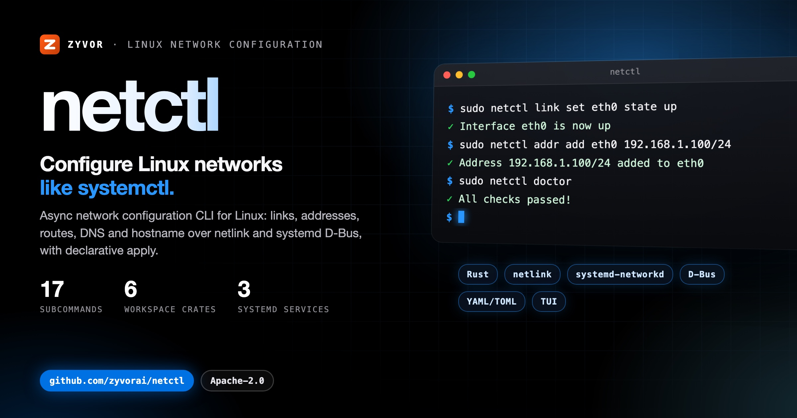
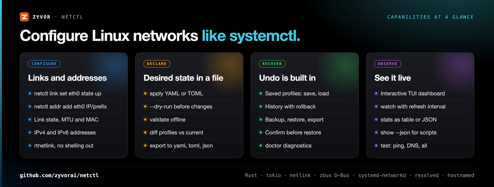
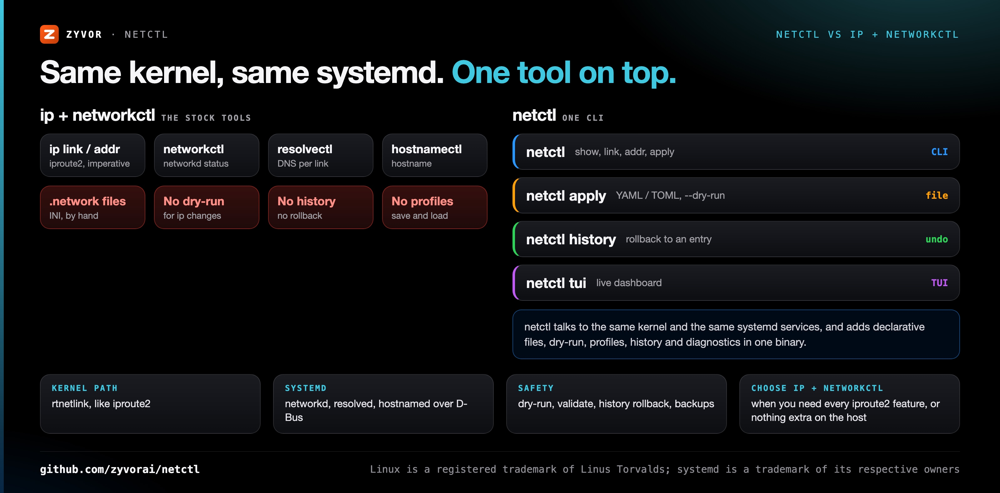
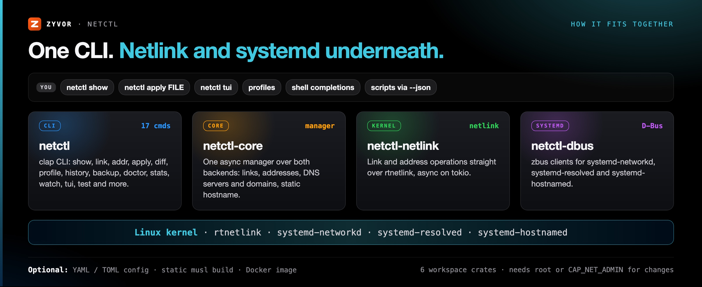

<div align="center">

# netctl

[](https://github.com/zyvorai/netctl/actions/workflows/ci.yml)
[](https://github.com/zyvorai/netctl/releases)
[](LICENSE)
[](https://www.rust-lang.org)

[](https://zyvor.dev/schedule?utm_source=github&utm_medium=netctl&utm_campaign=readme_hero)
[](https://zyvor.dev/poc?utm_source=github&utm_medium=netctl&utm_campaign=readme_hero)
[](#quickstart)



### Configure Linux networks like systemctl.

**A network configuration CLI for Linux with a `systemctl`-style interface.** Links and addresses over **netlink**; **systemd-networkd**, **systemd-resolved** and **systemd-hostnamed** over D-Bus; declarative YAML/TOML apply with dry-run, profiles, history rollback, backups and `doctor` diagnostics.

**Rust, async-first** · **17 subcommands** · **Declarative YAML/TOML apply** · **History and rollback** · **TUI dashboard**

📖 **[User docs](docs/user/README.md)** — installation, declarative apply, and troubleshooting.

</div>

---

## Why netctl

| When this happens… | netctl gives you… |
|---|---|
| Every host change is a string of `ip` commands nobody can review | **`netctl apply`** a YAML or TOML file, with `--dry-run` first and `validate` offline |
| A change goes wrong and nobody remembers the previous state | **`netctl history`** with rollback to an entry, plus named `backup` create / restore / export |
| You switch between known-good setups (lab, bench, maintenance) | **`netctl profile`** save, load, list and show, and `diff` a profile against `current` |
| "Is it the network or the host?" takes an hour | **`netctl doctor`** diagnostics and **`netctl test`** for connectivity, DNS and ping |
| Scripts scrape human-readable output | **`--json`** on `show`, JSON `stats`, and `export` to YAML, TOML or JSON |
| You want to watch interfaces while you work | **`netctl tui`** dashboard and **`netctl watch`** with a refresh interval |



---

## netctl vs ip + networkctl



| | **netctl** | **ip + networkctl** (stock tools) |
|---|---|---|
| Links and addresses | `netctl link set`, `netctl addr add` over rtnetlink | `ip link`, `ip addr` over rtnetlink |
| systemd integration | networkd, resolved and hostnamed over D-Bus from one tool | `networkctl`, `resolvectl`, `hostnamectl` as separate tools |
| Declarative config | `netctl apply` YAML or TOML, `--dry-run`, `validate` | `.network` / `.netdev` INI files written by hand |
| Undo | `history` rollback, named backups, saved profiles | Not built in |
| Compare | `diff` profiles against the current state | Not built in |
| Live view | `tui` dashboard, `watch`, `stats` | `ip monitor`, `networkctl status` |
| **Choose ip + networkctl when** | | You need the full iproute2 feature surface, or want nothing beyond the base system on the host |

---

## How it fits together



### Architecture

Workspace crates: `netctl` (CLI), `netctl-core`, `netctl-netlink`, `netctl-dbus`, `netctl-config`, `netctl-types`.

---

## Quickstart

Requires Rust 1.75+ to build, and root or `CAP_NET_ADMIN` to change the network.

```bash
git clone https://github.com/zyvorai/netctl.git
cd netctl
cargo build --release
sudo cp target/release/netctl /usr/local/bin/
```

```bash
sudo netctl show
sudo netctl link set eth0 state up
sudo netctl addr add eth0 192.168.1.100/24
netctl show --json
```

Declarative apply:

```bash
sudo netctl apply config/network-config.example.yaml
```

## Features

- Link, address, route, DNS, and hostname management
- Declarative YAML/TOML apply, profiles, backup/restore, diff, and `doctor` diagnostics
- JSON output, watch mode, TUI, shell completions, and dry-run previews

## Installation

```bash
git clone https://github.com/zyvorai/netctl.git
cd netctl
cargo build --release
sudo cp target/release/netctl /usr/local/bin/
```

Pre-built binaries: [GitHub Releases](https://github.com/zyvorai/netctl/releases).

Docker:

```bash
docker build -t netctl:latest .
docker run --rm netctl:latest --help
```

Static musl build:

```bash
cargo install cross
cross build --release --target x86_64-unknown-linux-musl
```

## Configuration samples

| File | Description |
|------|-------------|
| [config/network-config.example.yaml](config/network-config.example.yaml) | YAML network profile |
| [config/network-config.example.toml](config/network-config.example.toml) | TOML network profile |

## Development

```bash
cargo test --workspace
cargo fmt --all -- --check
cargo clippy --workspace -- -D warnings
```

## Troubleshooting

- Network changes require root or `CAP_NET_ADMIN`.
- D-Bus features need `systemd-networkd`, `systemd-resolved`, and `systemd-hostnamed` running.
- Debian/Ubuntu build deps: `sudo apt install libdbus-1-dev pkg-config`

## Contributing

Issues and PRs: [github.com/zyvorai/netctl](https://github.com/zyvorai/netctl/issues).

## Enterprise

| | Community Edition (this repo) | Enterprise ([zyvor.dev](https://zyvor.dev/?utm_source=github&utm_medium=netctl&utm_campaign=readme_edition)) |
|---|------------------------------|-------------------------------------------------------------------------------------|
| **Support** | [GitHub Issues](https://github.com/zyvorai/netctl/issues) | SLA, [sales@zyvor.dev](mailto:sales@zyvor.dev), professional services |
| **Scope** | CLI and declarative apply | Supported rollouts with netevd and cloud-netconfig |
| **Platform** | netctl | Full Zyvor networking and migration stack |
| **Features** | Link/address/route/DNS/hostname management, declarative YAML/TOML apply, `doctor` diagnostics, TUI, shell completions | Same feature set, operated at fleet scale with SLA-backed support |

| | |
|---|---|
| **Demo** | [zyvor.dev/demo](https://zyvor.dev/demo?utm_source=github&utm_medium=netctl&utm_campaign=readme_edition) |
| **ROI** | [zyvor.dev/roi](https://zyvor.dev/roi?utm_source=github&utm_medium=netctl&utm_campaign=readme_edition) |
| **Pricing** | [zyvor.dev/pricing](https://zyvor.dev/pricing?utm_source=github&utm_medium=netctl&utm_campaign=readme_edition) |
| **Contact** | [zyvor.dev/contact](https://zyvor.dev/contact?utm_source=github&utm_medium=netctl&utm_campaign=readme_edition) · [sales@zyvor.dev](mailto:sales@zyvor.dev) |

Community Edition covers CLI usage and declarative apply. Enterprise SLAs and the full stack with [netevd](https://github.com/zyvorai/zyvor-netevd) and [cloud-netconfig](https://github.com/zyvorai/zyvor-cloud-netconfig) → contact Zyvor (not GitHub Issues). Details: [docs/enterprise.md](docs/enterprise.md).

## Support the project

netctl Community Edition is free and open source, maintained by **Susant Sahani** · [Zyvor AI Labs](https://zyvor.dev/?utm_source=github&utm_medium=netctl&utm_campaign=readme_footer)

- **Enterprise / production:** [zyvor.dev/contact](https://zyvor.dev/contact?utm_source=github&utm_medium=netctl&utm_campaign=readme_footer) · [sales@zyvor.dev](mailto:sales@zyvor.dev)
- **Demo and PoC:** [Book a demo](https://zyvor.dev/schedule?utm_source=github&utm_medium=netctl&utm_campaign=readme_footer) · [30-day PoC](https://zyvor.dev/poc?utm_source=github&utm_medium=netctl&utm_campaign=readme_footer)
- **Community help:** [GitHub Issues](https://github.com/zyvorai/netctl/issues)

---

## Maturity

netctl is at version **1.1.1** (workspace `Cargo.toml`), with pre-built binaries on [GitHub Releases](https://github.com/zyvorai/netctl/releases). The Community Edition covers CLI usage and declarative apply; supported fleet rollouts are an Enterprise engagement ([docs/enterprise.md](docs/enterprise.md)).

---

## Part of the Zyvor stack

| Product | Role next to netctl |
|---|---|
| **netctl** | Network configuration CLI for Linux: netlink plus systemd over D-Bus |
| **[netevd](https://github.com/zyvorai/zyvor-netevd)** | Pairs with netctl: turns netlink and opt-in eBPF events into hook scripts, policy routing, a REST API and metrics |
| **[cloud-netconfig](https://github.com/zyvorai/zyvor-cloud-netconfig)** | Pairs with netctl on cloud VMs: secondary IPs and policy routing from cloud metadata |
| **[Netra](https://github.com/zyvorai/zyvor-netra)** | Next to netctl: eBPF network observability and emergency network control for Linux and Kubernetes |

Enterprise rollouts cover netctl together with netevd and cloud-netconfig. All projects: [zyvorai](https://github.com/zyvorai).

→ [zyvor.dev](https://zyvor.dev)

---

## License

netctl is **free and open source** under the [Apache License 2.0](LICENSE) (see [NOTICE](NOTICE)): use, modify and run it for personal, lab and commercial production use at no charge. That does not change.

**Zyvor Enterprise** adds what production teams ask for: supported releases, deployment and upgrade guidance, priority incident triage, a named technical contact and 24x7 critical intake. Plans and terms: [docs/SUBSCRIPTION-MODEL.md](docs/SUBSCRIPTION-MODEL.md) · [Pricing](https://zyvor.dev/pricing?utm_source=github&utm_medium=netctl&utm_campaign=readme_license) · [sales@zyvor.dev](mailto:sales@zyvor.dev).

---

<div align="center">

### Make every host network change reviewable

[](https://zyvor.dev/schedule?utm_source=github&utm_medium=netctl&utm_campaign=readme_footer)
[](https://zyvor.dev/poc?utm_source=github&utm_medium=netctl&utm_campaign=readme_footer)
[](https://zyvor.dev/pricing?utm_source=github&utm_medium=netctl&utm_campaign=readme_footer)
[](mailto:sales@zyvor.dev?subject=netctl)
[](https://github.com/zyvorai/netctl)

</div>
